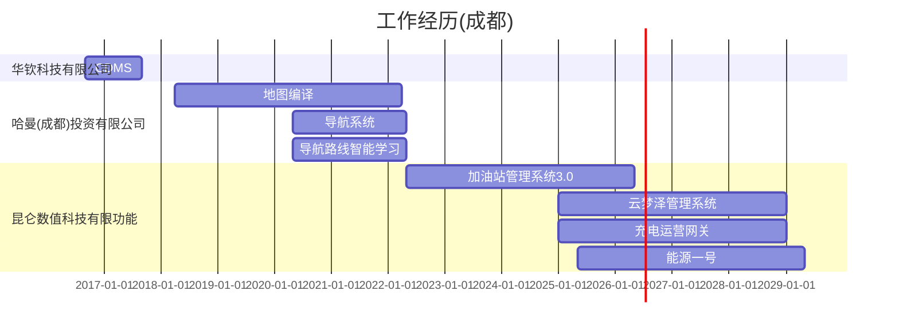
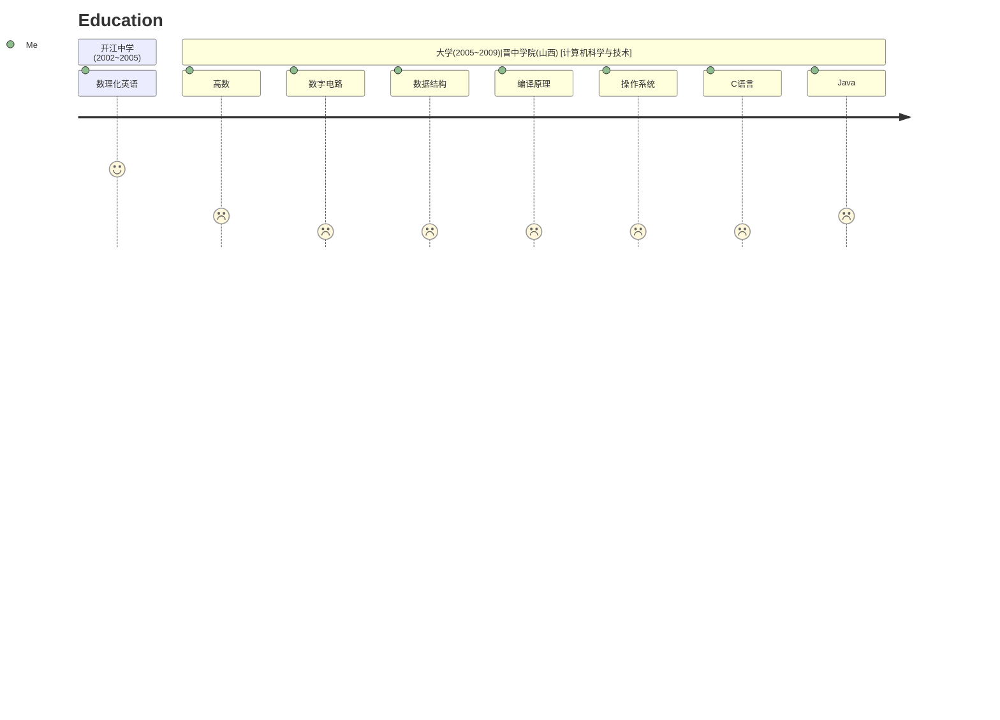

> Tao just is a software engineer.


## Profile

```json
{
    "name":"Tao T",
    "email":"287828521[at]qq.com",
    "location":"Chengdu China",
    "skills":[
        "Java","Spring","Spring Cloud"
        "Rust",
        "Golang"
        "Python"
    ],
    "hobbies":[
        "Vim","Linux"
    ]
}
```
## Career & Projects

- [ ] **2022.05 ~ Now** [昆仑数智科技有限公司](#)
    -  Android App Driver(Java)
    -  Spring Cloud System(Java,Spring,K8s)
- [x] **2018.04 ~ 2022.5** -  Spring Boot System(Java,Spring)
    -  Android OS | Navigation App(Java,C++,Python)
    -  GIS Map Data Compiler(Java)
- [x] 2016.09 ~ 2018.3 [华钦科技有限公司](#)
    - Spring Cloud System(Java,Spring,K8s,nodejs,mocha)



## Education

