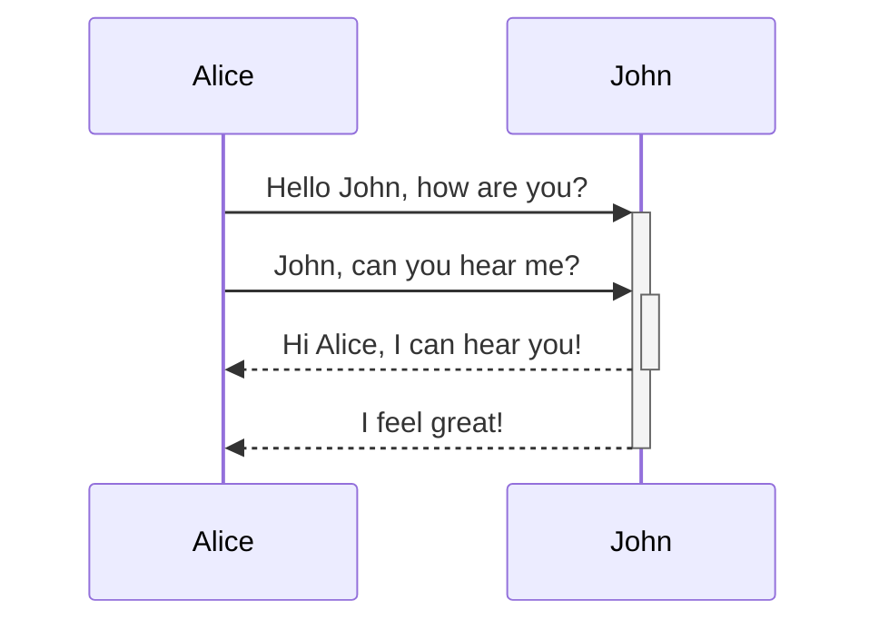

## Step 0. 说明一个模板文件

```txt
layouts/
  └── _markup/
      ├── render-codeblock-mermaid.html
      ├── render-codeblock-python.html
      └── render-codeblock.html
```

## Step 1. Install Hugo

- markup
```html
<!-- layouts/_default/_markup/render-codeblock-mermaid.html -->
<pre class="mermaid">
  {{ .Inner | htmlEscape | safeHTML }}
</pre>
{{ .Page.Store.Set "hasMermaid" true }}
```
- 添加渲染资源

```html
<!-- layouts/_footer.html -->
{{ if .Store.Get "hasMermaid" }}
<script src="https://cdn.jsdelivr.net/npm/mermaid@10.9.0/dist/mermaid.min.js"></script>
<script>
  document.addEventListener('DOMContentLoaded', () => {
    mermaid.initialize({ 
      theme: 'default',
      startOnLoad: true
    });
  });
</script>
{{ end }}

```

## Step 3. show mermaid

